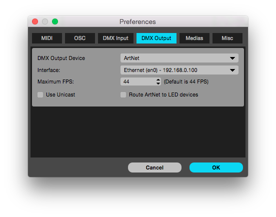

## Table of contents
- [Table of contents](#table-of-contents)
- [ArtNET - DMX over Ethernet setup](#artnet---dmx-over-ethernet-setup)
  * [Hardware](#hardware)
  * [Software](#software)
- [Hardware Wiring](#hardware-wiring)
- [Network settings](#network-settings)
- [eDMX configuration](#edmx-configuration)
- [DMX LED output with madlight](#dmx-led-output-with-madlight)

## ArtNET - DMX over Ethernet setup

### Hardware

+ [eDMX4 PRO DIN interface](https://dmxking.com/artnetsacn/edmx4-pro-din/)
+ [4 - 24 Amps constant voltage LED driver LINEARdrive 222D](https://www.eldoled.com/led-drivers/lineardrive/4-24-amps-constant-voltage-led-drivers/dc-222d/)
+ [LEDLUS LS linear](http://insta.de/en/lightment/product?LEDLUXLSlinear&group=LEDLUX&qid=241)
+ [Power supply output 6.2A - 29V](http://eu.mouser.com/ProductDetail/Mean-Well/HLG-185H-30A/?qs=3IPTn0w%2F0t%252bLlkD8mGnFmw%3D%3D)

### Software

+ [eDMX4 Configuration](https://dmxking.com/artnetsacn/edmx4-pro-din/)
+ [madlight MadMapper](http://www.madmapper.com/)

## Hardware Wiring

## Network settings

## eDMX configuration

## DMX LED output with madlight

